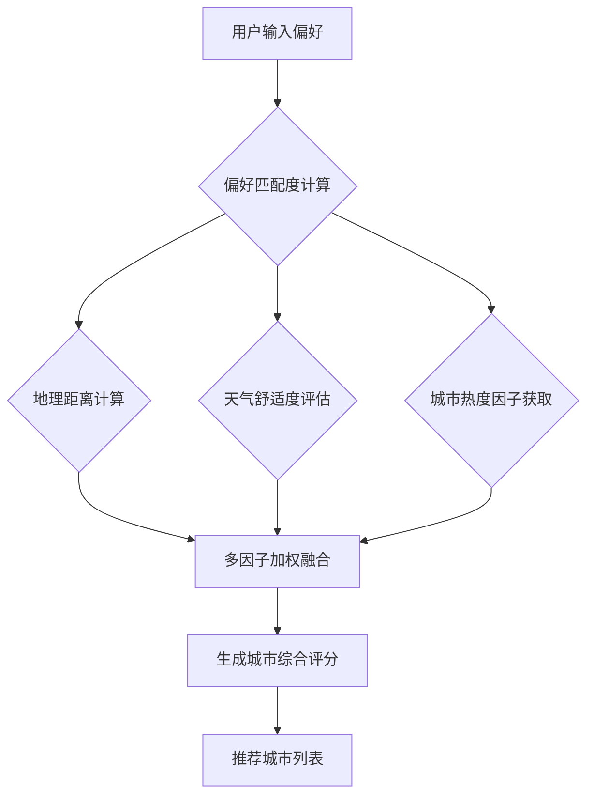

# 第 4 章 系统设计

## 4.1 总体架构设计

本旅游城市推荐系统采用典型的**前后端分离的四层分布式架构**，旨在实现高内聚、低耦合的模块化设计，确保系统的可扩展性、可维护性和高并发处理能力。系统架构（如图 4-1 所示）主要划分为数据层、服务层、业务逻辑层和展示层。

```mermaid
graph TD
    subgraph 用户层
        A[用户界面(Vue 3)]
    end

    subgraph 业务逻辑层
        B[推荐控制器(Spring Boot)] --> C[推荐服务]
        B --> D[用户服务]
        B --> E[城市服务]
        B --> F[天气服务]
    end

    subgraph 服务层
        C --> G[推荐算法模块]
        D --> H[用户偏好模块]
        E --> I[城市数据模块]
        F --> J[第三方天气API]
        K[第三方地图API]
    end

    subgraph 数据层
        G --> L[MariaDB]
        H --> L
        I --> L
        J --> M[Valkey (Redis) 缓存]
        K --> M
        L --> M
    end

    A -- RESTful API --> B
    C -- 调用 --> G
    D -- 存储/读取 --> H
    E -- 存储/读取 --> I
    F -- 调用 --> J
    E -- 调用 --> K
    G -- 读取 --> L
    H -- 读取/写入 --> L
    I -- 读取/写入 --> L
    J -- 缓存 --> M
    K -- 缓存 --> M
    L -- 缓存 --> M
```

**图 4-1 系统总体架构设计图**

*   **展示层（前端）：** 基于 Vue 3 框架构建，负责用户界面的渲染、用户交互处理、用户偏好输入以及推荐结果的动态展示。通过异步请求与后端服务进行数据交互，实现丰富的用户体验。
*   **业务逻辑层（后端）：** 采用 Spring Boot 框架，部署为一组 RESTful API 服务。该层负责接收前端请求，协调服务层完成业务逻辑处理，如用户认证、偏好管理、推荐算法调用、数据聚合等。主要包含 `RecommendationController`、`UserController`、`CityController` 等。
*   **服务层：** 封装具体的业务逻辑实现和第三方服务集成。
    *   **推荐算法模块：** 实现了核心推荐算法，根据用户偏好和动态因子计算推荐结果。
    *   **用户偏好模块：** 管理用户的兴趣标签、出发地、出行日期等信息。
    *   **城市数据模块：** 提供城市基础信息、特征标签、地理位置等数据。
    *   **天气服务：** 调用第三方天气 API（和风天气）获取实时天气数据，并进行缓存。
    *   **地图服务：** 调用第三方地图 API（高德/百度地图）进行地理位置解析和距离计算。
*   **数据层：** 负责所有数据的持久化存储和高速缓存。
    *   **MariaDB 数据库：** 作为主要数据存储，用于存储用户数据、城市特征、标签、天气预报历史等结构化数据。
    *   **Valkey (Redis 兼容) 缓存：** 作为高速缓存层，用于存储热点数据、API 响应结果（如天气预报），以提升系统响应速度和减轻数据库压力。

## 4.2 核心模块设计

### 4.2.1 用户偏好收集模块

*   **功能：** 收集用户的出发地、旅游兴趣标签（多选）和计划出行日期。
*   **设计要点：**
    *   **前端交互：** 提供直观的表单界面，通过下拉菜单选择出发地，多选框选择兴趣标签，日期选择器选择出行日期。
    *   **后端存储：** 将用户偏好存储在 MariaDB 数据库中，与用户 ID 关联。
    *   **实时更新：** 用户偏好变更后，系统应能立即更新并触发新的推荐计算。

### 4.2.2 推荐引擎模块

这是系统的核心，负责生成个性化推荐列表。

*   **数据输入：** 用户偏好数据、城市特征标签、天气预报数据、城市热度数据。
*   **算法流程（如图 4-2 所示）：**



**图 4-2 推荐引擎模块算法流程图**

*   **偏好匹配度计算：** 基于内容推荐算法，计算用户兴趣标签与城市特征标签的匹配程度。例如，采用 Jaccard 相似度或 TF-IDF 等方法量化匹配度。
*   **地理距离计算：** 使用 Haversine 公式或调用地图 API，计算用户出发地与各个候选城市之间的直线距离或实际交通距离。
*   **天气舒适度评估：** 根据用户选择的出行日期，查询推荐城市的未来天气预报，评估天气是否适宜旅行（如晴天加权、雨雪减权、适宜温度范围加权）。
*   **城市热度因子：** 结合城市实时热度数据，对热门城市进行适当加权或根据用户设置进行规避。
*   **多因子加权融合：** 将上述匹配度、距离、天气、热度等因子进行加权求和，生成每个城市的综合评分。权重可根据用户反馈或预设策略进行调整。
    *   **评分公式示例：** `Score = w_preference * PreferenceScore + w_distance * DistanceScore + w_weather * WeatherScore + w_popularity * PopularityScore`
        *   `w_i` 为各因子的权重，且 `Σw_i = 1`。

## 4.3 数据库设计

本系统数据库设计采用 MariaDB，主要包括用户表、城市表、标签表、用户兴趣标签关联表、天气预报表、城市热度表等。所有表遵循命名规范，表名和字段名采用小写蛇形命名（snake_case）。

**主要表结构设计：**

*   **`user` 表 (用户表)：**
    *   `id` (BIGINT, PRIMARY KEY, AUTO_INCREMENT)
    *   `username` (VARCHAR(50), UNIQUE)
    *   `password_hash` (VARCHAR(255))
    *   `email` (VARCHAR(100), UNIQUE)
    *   `create_time` (DATETIME)
    *   `update_time` (DATETIME)
    *   `last_login_time` (DATETIME)
    *   `current_city_id` (BIGINT, FK to city.id) - 用户当前所在地或出发地

*   **`city` 表 (城市信息表)：**
    *   `id` (BIGINT, PRIMARY KEY, AUTO_INCREMENT)
    *   `name` (VARCHAR(100), UNIQUE)
    *   `province` (VARCHAR(50))
    *   `longitude` (DECIMAL(10, 7))
    *   `latitude` (DECIMAL(10, 7))
    *   `description` (TEXT)
    *   `create_time` (DATETIME)
    *   `update_time` (DATETIME)

*   **`tag` 表 (兴趣标签表)：**
    *   `id` (BIGINT, PRIMARY KEY, AUTO_INCREMENT)
    *   `name` (VARCHAR(50), UNIQUE)
    *   `type` (VARCHAR(50)) - 例如：旅游兴趣、城市特色等
    *   `create_time` (DATETIME)
    *   `update_time` (DATETIME)

*   **`user_interest_tag` 表 (用户兴趣标签关联表)：**
    *   `user_id` (BIGINT, PRIMARY KEY, FK to user.id)
    *   `tag_id` (BIGINT, PRIMARY KEY, FK to tag.id)
    *   `create_time` (DATETIME)
    *   复合主键 (`user_id`, `tag_id`)

*   **`city_feature_tag` 表 (城市特征标签关联表)：**
    *   `city_id` (BIGINT, PRIMARY KEY, FK to city.id)
    *   `tag_id` (BIGINT, PRIMARY KEY, FK to tag.id)
    *   `weight` (DECIMAL(5, 2)) - 标签对城市特征的重要性权重
    *   复合主键 (`city_id`, `tag_id`)

*   **`weather_forecast` 表 (天气预报缓存表)：**
    *   `id` (BIGINT, PRIMARY KEY, AUTO_INCREMENT)
    *   `city_id` (BIGINT, FK to city.id)
    *   `forecast_date` (DATE)
    *   `weather_condition` (VARCHAR(50)) - 天气状况，如“晴”、“多云”
    *   `min_temp` (DECIMAL(5, 2))
    *   `max_temp` (DECIMAL(5, 2))
    *   `wind_direction` (VARCHAR(50))
    *   `update_time` (DATETIME) - 记录天气API最后更新时间，用于缓存失效判断

*   **`city_popularity` 表 (城市热度表)：**
    *   `id` (BIGINT, PRIMARY KEY, AUTO_INCREMENT)
    *   `city_id` (BIGINT, UNIQUE, FK to city.id)
    *   `popularity_score` (DECIMAL(10, 2)) - 城市热度分数
    *   `update_time` (DATETIME) - 热度数据最后更新时间

**索引优化措施：**
*   在 `user` 表的 `username` 和 `email` 字段上创建唯一索引。
*   在 `city` 表的 `name` 和 `province` 字段上创建索引。
*   在 `user_interest_tag` 和 `city_feature_tag` 表的外键字段上创建索引以加速联表查询。
*   在 `weather_forecast` 表的 `city_id` 和 `forecast_date` 字段上创建复合索引，以优化天气查询。
*   在 `city_popularity` 表的 `city_id` 字段上创建唯一索引，并可在 `popularity_score` 字段上创建索引以支持热门城市排序查询。

## 4.4 可视化设计

前端可视化设计旨在提供直观、美观且响应式的用户体验，主要包括推荐结果展示、用户偏好输入界面和城市详情页面。

*   **推荐结果列表：**
    *   以卡片形式展示每个推荐城市，包含城市名称、省份、推荐理由摘要、关键标签、天气预报概览、距离等信息。
    *   支持图片轮播或背景图，增强视觉吸引力。
    *   提供筛选和排序功能（按距离、按评分、按天气舒适度、按热度），用户可根据需求动态调整。
*   **用户偏好输入界面：**
    *   采用表单形式，输入出发地（通过搜索框和下拉列表）、兴趣标签（多选标签云或复选框组）、出行日期（日期选择器）。
    *   界面简洁，引导性强，提供实时反馈。
*   **城市详情页面：**
    *   展示所选城市的详细信息，包括城市介绍、全部特征标签、详细天气预报、历史热度趋势图。
    *   集成地图组件，标注城市地理位置。

## 4.5 关键算法设计

### 4.5.1 城市综合评分算法

本系统采用多因子加权融合的策略计算城市综合评分，以实现个性化推荐。

**评分因子：**
1.  **用户偏好匹配度（PreferenceScore）：**
    *   计算用户选择的兴趣标签集合 `U_tags` 与城市特征标签集合 `C_tags` 的 Jaccard 相似度。
    *   `PreferenceScore = |U_tags ∩ C_tags| / |U_tags ∪ C_tags|`
2.  **地理距离因子（DistanceScore）：**
    *   计算用户出发地与候选城市之间的 Haversine 距离 `D`。
    *   `DistanceScore = max_distance / (D + 1)`，其中 `max_distance` 为预设的最大有效距离，`+1` 避免除零，距离越近得分越高。
3.  **天气舒适度因子（WeatherScore）：**
    *   根据用户选择的出行日期，获取城市天气预报。
    *   设定天气舒适度规则：例如，晴天/多云得 [1.0] 分，小雨/阴天得 [0.7] 分，大雨/极端天气得 [0.3] 分；温度在 [15-28]°C 区间内加分。
    *   `WeatherScore` 介于 [0, 1] 之间。
4.  **城市热度因子（PopularityScore）：**
    *   归一化城市热度表中的 `popularity_score`，使其介于 [0, 1] 之间。

**综合评分公式：**
`FinalScore = w_pref * PreferenceScore + w_dist * DistanceScore + w_weather * WeatherScore + w_pop * PopularityScore`
其中，`w_pref, w_dist, w_weather, w_pop` 为各因子的权重，且 `w_pref + w_dist + w_weather + w_pop = 1`。初始权重可设置为 `w_pref=0.4, w_dist=0.3, w_weather=0.2, w_pop=0.1`。

### 4.5.2 推荐算法流程伪代码

```
Function GenerateRecommendations(user_id, departure_city_id, interest_tags, travel_dates):
    user_preferences = GetUserPreferences(user_id) // 获取用户详细偏好

    candidate_cities = GetAllCities() // 获取所有候选城市

    recommendations = []

    For each city in candidate_cities:
        city_features = GetCityFeatures(city.id)
        city_weather = GetWeatherForecast(city.id, travel_dates)
        city_popularity = GetCityPopularity(city.id)

        // 计算各项因子
        preference_score = CalculatePreferenceScore(user_preferences.interest_tags, city_features.tags)
        distance_score = CalculateDistanceScore(departure_city_id, city.id)
        weather_score = CalculateWeatherScore(city_weather)
        popularity_score = CalculatePopularityScore(city_popularity)

        // 计算综合评分
        final_score = CalculateFinalScore(preference_score, distance_score, weather_score, popularity_score)

        Add city with final_score to recommendations

    Sort recommendations by final_score in descending order

    Return top N recommendations
```

### 4.5.3 数据处理与存储优化

*   **缓存策略：**
    *   **天气数据缓存：** 第三方天气 API 返回结果缓存到 Valkey，设置有效期 [1] 小时，避免频繁调用。
    *   **热门城市缓存：** 定期计算热门城市列表并缓存到 Valkey。
    *   **用户偏好缓存：** 用户的活跃偏好信息可短期缓存，减少数据库查询。
*   **数据库索引：** 确保所有外键字段和高频查询字段都建立索引，提升查询性能。
*   **地理空间索引：** MariaDB 支持地理空间索引（如 R-tree 索引），可进一步加速基于地理位置的查询。

本章设计的总体架构、模块划分、数据库结构、可视化方案以及核心算法，旨在为“旅游城市推荐系统”提供一个高效、稳定且可扩展的实现蓝图，以满足个性化、动态化的推荐需求。

## 参考文献

[1] 邱薛莉,徐春.融合多模态与多头注意力的旅游推荐模型[J].信息记录材料,2026,27(03):156-158+180.DOI:10.16009/j.issn.1009-5624.2026.03.049.
[2] 许芳芳.国内个性化旅游推荐研究进展[J].电脑知识与技术,2025,21(26):32-36.DOI:10.14004/j.cnki.ckt.2025.1345.
[3] 朱志国,孙怡,王谢宁,等.偏好融合的旅游群组景点推荐:基于深度学习的框架模型[J].系统科学与数学,2025,45(02):470-484.
[4] 王茸,李强,何颖,等.个性化旅游推荐系统的设计与实现[J].福建电脑,2023,39(09):95-99.DOI:10.16707/j.cnki.fjpc.2023.09.020.
[5] 班航.基于旅游大数据的用户画像建模及个性化推荐研究[D].安徽工程大学,2023.DOI:10.27763/d.cnki.gahgc.2023.000038.
[6] 黄宇浩,顾得豪,胡炎林,等.基于标签挖掘和聚类算法的新用户快速兴趣建模[J].计算机时代,2023,(05):88-90.DOI:10.16644/j.cnki.cn33-1094/tp.2023.05.019.
[7] 陈思宇.基于知识图谱和用户动态偏好的旅游推荐算法研究[D].桂林理工大学,2023.DOI:10.27050/d.cnki.gglgc.2023.000386.
[8] 陈勇.基于协同过滤算法的旅游推荐系统的设计[J].价值工程,2022,41(30):160-162.
[9] 宋羿弢.基于用户情感画像的旅游推荐方法研究[D].中北大学,2021.DOI:10.27470/d.cnki.ghbgc.2021.000554.
[10] 梁存桂.基于Spark云计算平台的旅游景点推荐算法优化研究[D].桂林理工大学,2021.DOI:10.27050/d.cnki.gglgc.2021.000351.
[11] 王小芳,刘树林,刘洪江.融合机器学习算法在旅游推荐中的研究与实现[J].电脑知识与技术,2020,16(09):198-199.DOI:10.14004/j.cnki.ckt.2020.1070.
